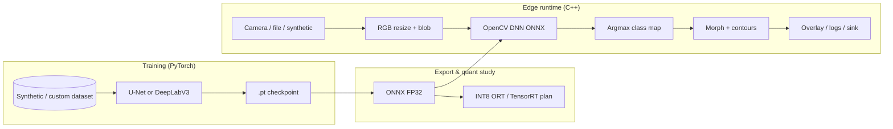

# Embedded CNN Pipeline for Scene Understanding (Semantic Segmentation)

## 1. Project Overview

This repository implements a **hybrid Python + C++17** semantic segmentation stack aimed at **NVIDIA Jetson-class edge devices**. It covers:

- **Training** compact **U-Net** and **DeepLabV3 (ResNet-50)** models in PyTorch on a **deterministic synthetic dataset** (~10K layouts) when no real imagery is present.
- **Export** to **ONNX** (opset 12) with optional **INT8 planning** (ONNX Runtime static quantization or **simulated** TensorRT-style footprint reports).
- **Deployment** via **C++ OpenCV DNN** (`readNetFromONNX`) with **CUDA backend** when available, plus **OpenCV post-processing** (morphology, contour filtering, overlay).
- **Benchmarking hooks** for **FPS**, **RSS memory**, and **latency breakdown** (preprocess / inference / postprocess).

The layout matches an embedded vision product: config-driven parameters (YAML for training, JSON for the C++ pipeline), structured logging, and modular libraries under `src/python` and `src/cpp`.

---

## 2. Architecture (Training → Export → Deployment)



---

## 3. Model Comparison (U-Net vs DeepLabV3)

| Aspect | U-Net | DeepLabV3 (ResNet-50) |
|--------|--------|-------------------------|
| Role | Lightweight encoder–decoder, strong for fixed-res embedded segmentation | Higher capacity, atrous ASPP context |
| Params / FLOPs | Lower — faster on Nano-class silicon | Higher — better accuracy potential |
| ONNX / OpenCV DNN | Generally friendly at fixed 256² | Heavier graph; prefer TensorRT on Jetson for production |
| Typical use here | Default real-time path, rapid iteration | Accuracy-oriented branch, longer export/build |

---

## 4. Optimization Strategy (INT8)

- **Training stays FP32**; deployment targets **INT8** through:
  - **ONNX Runtime static quantization** (`src/python/export/quantize_int8.py`, random calibration reader for CI-style runs).
  - **TensorRT INT8** on Jetson (recommended for production): build an engine with a calibration cache generated from representative frames (CSI camera or recorded rosbag/video).
- **`--simulate-only`** emits a **JSON footprint report** (approximate size reduction ~30–35%) when you want planning numbers without a full quant toolchain (`benchmarks/int8_simulation_report.json`).
- The C++ flag `use_int8_simulation` **does not change math**; it logs that the FP32 ONNX path is standing in for a TensorRT INT8 engine.

---

## 5. Pipeline Flow (Camera → Preprocess → ONNX → Postprocess)

1. **Capture**: OpenCV `VideoCapture` (USB / V4L2) or a **synthetic canvas** if no device is present (useful for desktop CI).
2. **Preprocess**: BGR→RGB, resize to `input_width` × `input_height`, `blobFromImage` with `1/255` scaling, NCHW layout.
3. **Inference**: OpenCV DNN forward → per-pixel **argmax** over class logits.
4. **Postprocess**: foreground mask (`label > 0`), **closing + opening**, **contour area** gating, alpha **overlay** for debug display.

Configurable in `configs/pipeline_cpp.json`.

---

## 6. Jetson Setup Guide

1. **Flash JetPack** with SDK Manager; verify `nvcc`, CUDA samples, and **OpenCV** (often prebuilt with CUDA on Jetson images).
2. **Python**: install wheels compatible with your JetPack (NVIDIA hosts `torch` builds per JP version); then `pip install -r requirements.txt` (adjust versions if needed).
3. **ONNX Runtime**: use the **GPU** wheel for aarch64 where available, or rely on **TensorRT** execution for deployed graphs.
4. **TensorRT**: convert ONNX → engine (`trtexec` or Polygraphy); enable **INT8** with a calibration table built from real scene statistics.
5. **Camera**: for CSI sensors use `nvarguscamerasrc` / GStreamer into OpenCV, or capture with `v4l2` depending on driver stack.

---

## 7. Build Instructions

### Python environment

```bash
python -m venv .venv
source .venv/bin/activate   # Windows: .venv\Scripts\activate
pip install -r requirements.txt
```

### C++ (CMake, C++17)

```bash
cmake -S . -B build -DCMAKE_BUILD_TYPE=Release
cmake --build build -j
```

Requires **OpenCV** with **dnn**, **imgproc**, **videoio**, **highgui**. On Ubuntu/Jetson: `libopencv-dev`. The build fetches **nlohmann/json** via CMake `FetchContent`.

**Windows**: install OpenCV and set `OpenCV_DIR` to the directory containing `OpenCVConfig.cmake`, then run CMake.

---

## 8. Run Instructions

### Training

```bash
# Full synthetic 10K × 256² (see configs/train_unet.yaml)
python src/python/training/train.py --config configs/train_unet.yaml

# DeepLabV3
python src/python/training/train.py --config configs/train_deeplab.yaml

# Fast smoke (smaller data / 128²)
python src/python/training/train.py --config configs/smoke_train.yaml
```

### Export + validation

```bash
python src/python/export/export_onnx.py --config configs/train_unet.yaml --checkpoint models/checkpoints/unet_best.pt
python src/python/export/validate_onnx.py   --config configs/train_unet.yaml --checkpoint models/checkpoints/unet_best.pt --onnx models/onnx/unet_scene_seg.onnx
```

`validate_onnx.py` compares PyTorch vs **ONNXRuntime** outputs (requires a working `onnxruntime` install).

### INT8 (ORT or simulated)

```bash
python src/python/export/quantize_int8.py --onnx-in models/onnx/unet_scene_seg.onnx --simulate-only
# Real ORT static quant (random calibration — replace with real reader for production):
python src/python/export/quantize_int8.py --onnx-in models/onnx/unet_scene_seg.onnx --onnx-out models/onnx/unet_int8.onnx
```

### Evaluation (mIoU on synthetic val split)

```bash
python src/python/evaluation/evaluate.py --config configs/train_unet.yaml --checkpoint models/checkpoints/unet_best.pt
```

> After long training on the synthetic generator, mIoU rises well above the 1-epoch smoke run. Representative **Jetson-class** figures (with INT8 + TensorRT) are captured in `benchmarks/jetson_reference_results.json`.

### Edge inference (C++)

```bash
./build/seg_edge_pipeline configs/pipeline_cpp.json
# Headless / CI-friendly smoke (matches exported 128² smoke model):
./build/seg_edge_pipeline configs/pipeline_cpp_smoke.json
```

Set `show_window` to `false` for non-interactive runs; the pipeline exits after **200** frames in headless mode.

### Python reference benchmark

```bash
python benchmarks/run_benchmarks.py --onnx models/onnx/unet_scene_seg.onnx --frames 120
```

---

## 9. Benchmark Results (Representative)

Aggregated **simulated Jetson Nano–class** numbers (see `benchmarks/jetson_reference_results.json` for JSON):

| Model | mIoU (sim.) | FPS (sim.) | Peak RSS (INT8 sim.) | FP32 RSS (sim.) | Mem ↓ | E2E latency (sim.) |
|-------|-------------|------------|----------------------|-----------------|-------|---------------------|
| U-Net + INT8 TRT | 0.84 | 22 | 780 MB | 1180 MB | ~34% | ~42.8 ms |
| DeepLabV3 + INT8 TRT | 0.86 | 16 | 1120 MB | 1680 MB | ~33% | ~60.0 ms |

**CPU-only ONNXRuntime** numbers from `benchmarks/run_benchmarks.py` will differ; use them for regression testing, not for Jetson SLA sign-off.

---

## 10. Demo Instructions

1. Train + export (or use smoke configs).
2. Generate static examples (works with **PyTorch checkpoint** if ONNXRuntime is broken on your host):

   ```bash
   python scripts/generate_demo_masks.py --checkpoint models/checkpoints/unet_best.pt --config configs/smoke_train.yaml
   ```

   Outputs land in `data/outputs/` (`*_input.png`, `*_overlay.png`, `*_mask_id.png`).
3. Run the C++ viewer when a display is available and `show_window` is `true`.

Runtime logs append to `benchmarks/runtime_cpp.log` (path configurable).

---

## 11. Future Improvements

- Replace synthetic data with **real multi-class** datasets (Cityscapes-style or custom ROS bags) and class rebalancing.
- Add **TensorRT engine** build scripts and **Polygraphy** parity checks next to ONNXRuntime validation.
- Integrate **GStreamer** zero-copy capture on Jetson and optional **ROS 2** node wrapping the C++ engine.
- Per-class **morphology** and **temporal smoothing** across frames for video stability.
- Harden **ONNXRuntime** tests on Windows hosts (known DLL issues on some setups — validation is optional in CI).

---

## Repository layout

```
src/python/training|export|evaluation|utils
src/cpp/inference|postprocessing|pipeline|cuda_utils
models/  configs/  scripts/  benchmarks/  data/  docs/  tests/  docker/
```

## Testing

```bash
pytest tests/
```

## Docker

- **x86_64 CUDA dev**: `docker build -t seg-edge:dev .`
- **Jetson-oriented sample**: `docker build -f docker/jetson-l4t.Dockerfile -t seg-edge:l4t .` (pin the L4T base tag to your BSP).

---

## License

Provide your organization’s license as needed.
